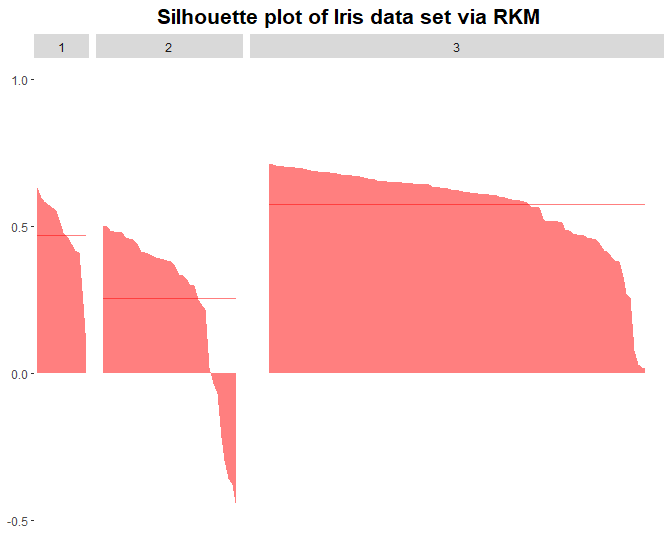
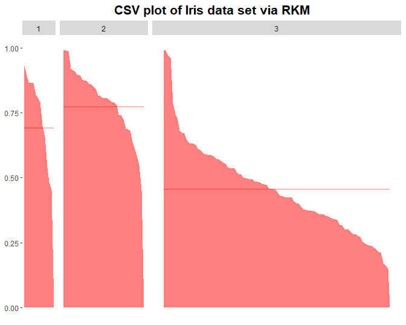
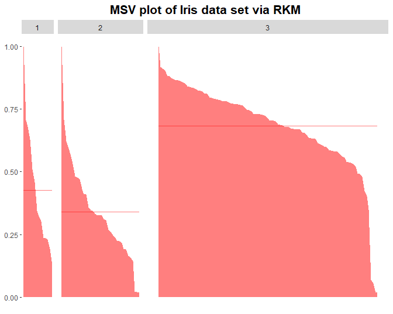
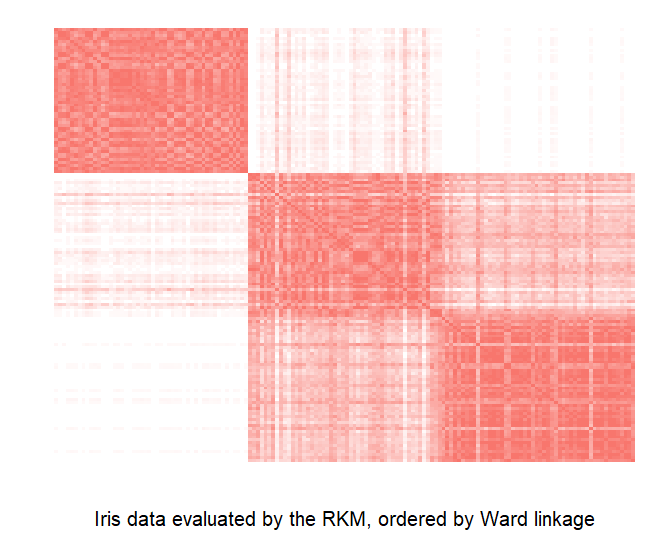
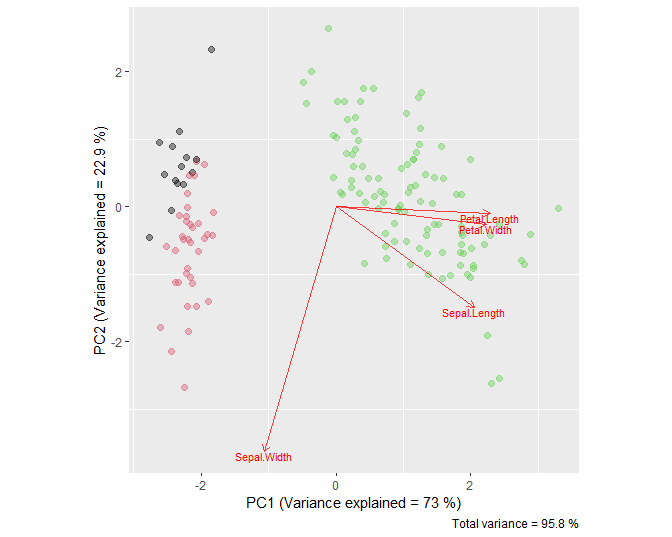
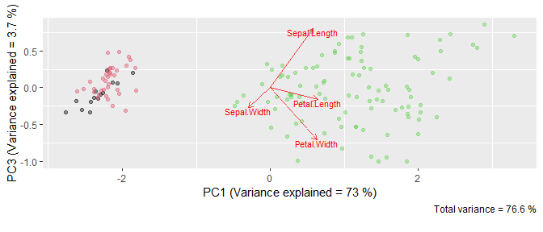
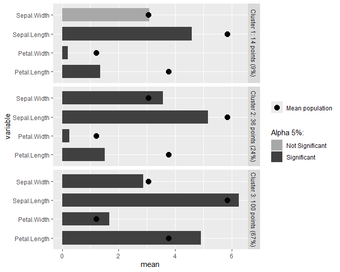
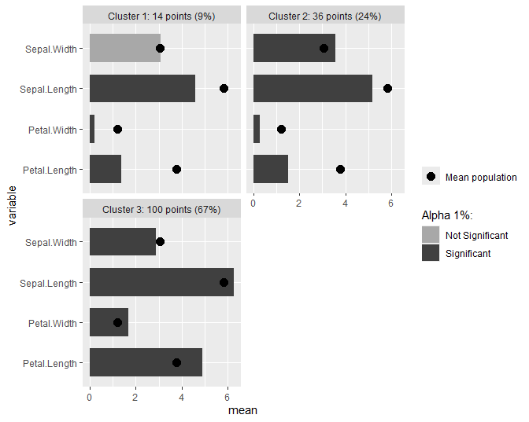

kmed: Distance-Based K-Medoids
================
Weksi Budiaji
2026-01-28

## 1. Introduction

The [**kmed**](https://cran.r-project.org/package=kmed) package is
designed to analyse k-medoids based clustering. The features include:

- distance computation:
  - numerical variables:
    - [Manhattan weighted by range](#mrw)
    - [squared Euclidean weighted by range](#ser)
    - [squared Euclidean weighted by squared range](#ser.2)
    - [squared Euclidean weighted by variance](#sev)
    - [unweighted squared Euclidean](#se)
  - binary or categorical variables:
    - [simple matching](#sm)
    - [co-occurrence](#cooc)
  - mixed variables:
    - [Gower](#gower)
    - [Wishart](#wishart)
    - [Podani](#podani)
    - [Huang](#huang)
    - [Harikumar and PV](#harikumar)
    - [Ahmad and Dey](#ahmad)
- k-medoids algorithms:
  - [Simple and fast k-medoids](#sfkm)
  - [K-medoids](#km)
  - [Rank k-medoids](#rkm)
  - [Increasing number of clusters k-medoids](#inckm)
  - [simple k-medoids](#skm)
- cluster validations:
  - internal criteria:
    - [Silhouette](#sil)
    - [Centroid-based shadow value](#csv)
    - [Medoid-based shadow value](#msv)
  - [relative criteria (bootstrap)](#boot)
- Cluster visualizations:
  - [pca biplot](#biplot)
  - [marked barplot](#barplotnum)

## 2. Distance Computation

### 2.A. Numerical variables (`distNumeric`)

The `distNumeric` function can be applied to calculate numerical
distances. There are four distance options, namely Manhattan weighted by
range (`mrw`), squared Euclidean weighted by range (`ser`), squared
Euclidean weighted by squared range (`ser.2`), squared Euclidean
weighted by variance (`sev`), and unweighted squared Euclidean (`se`).
The `distNumeric` function provides `method` in which the desired
distance method can be selected. The default `method` is `mrw`.

The distance computation in a numerical variable data set is performed
in the iris data set. An example of manual calculation of the numerical
distances is applied for the first and second objects only to introduce
what the `distNumeric` function does.

``` r
library(kmed)
iris[1:3,]
```

    ##   Sepal.Length Sepal.Width Petal.Length Petal.Width Species
    ## 1          5.1         3.5          1.4         0.2  setosa
    ## 2          4.9         3.0          1.4         0.2  setosa
    ## 3          4.7         3.2          1.3         0.2  setosa

#### 2.A.1. Manhattan weighted by range (`method = "mrw"`)

By applying the `distNumeric` function with `method = "mrw"`, the
distance among objects in the iris data set can be obtained.

``` r
num <- as.matrix(iris[,1:4])
rownames(num) <- rownames(iris)
#calculate the Manhattan weighted by range distance of all iris objects
mrwdist <- distNumeric(num, num)
#show the distance among objects 1 to 3
mrwdist[1:3,1:3]
```

    ##           1         2         3
    ## 1 0.0000000 0.2638889 0.2530603
    ## 2 0.2638889 0.0000000 0.1558380
    ## 3 0.2530603 0.1558380 0.0000000

The Manhattan weighted by range distance between objects 1 and 2 is
`0.2638889`. To calculate this distance, the range of each variable is
computed.

``` r
#extract the range of each variable
apply(num, 2, function(x) max(x)-min(x))
```

    ## Sepal.Length  Sepal.Width Petal.Length  Petal.Width 
    ##          3.6          2.4          5.9          2.4

Then, the distance between objects 1 and 2 is

``` r
#the distance between objects 1 and 2
abs(5.1-4.9)/3.6 + abs(3.5 - 3.0)/2.4 + abs(1.4-1.4)/5.9 + abs(0.2-0.2)/2.4
```

    ## [1] 0.2638889

which is based on the data

    ##   Sepal.Length Sepal.Width Petal.Length Petal.Width
    ## 1          5.1         3.5          1.4         0.2
    ## 2          4.9         3.0          1.4         0.2

[(Back to Intoduction)](#intro)

#### 2.A.2. squared Euclidean weighted by range (`method = "ser"`)

``` r
#calculate the squared Euclidean weighthed by range distance of all iris objects
serdist <- distNumeric(num, num, method = "ser")
#show the distance among objects 1 to 3
serdist[1:3,1:3]
```

    ##            1          2          3
    ## 1 0.00000000 0.11527778 0.08363936
    ## 2 0.11527778 0.00000000 0.02947269
    ## 3 0.08363936 0.02947269 0.00000000

The squared Euclidean weighted by range distance between objects 1 and 2
is `0.11527778`. It is obtained by

``` r
#the distance between objects 1 and 2
(5.1-4.9)^2/3.6 + (3.5 - 3.0)^2/2.4 + (1.4-1.4)^2/5.9 + (0.2-0.2)^2/2.4
```

    ## [1] 0.1152778

[(Back to Intoduction)](#intro)

#### 2.A.3. squared Euclidean weighted by squared range (`method = "ser.2"`)

``` r
#calculate the squared Euclidean weighthed by squared range distance of 
#all iris objects
ser.2dist <- distNumeric(num, num, method = "ser.2")
#show the distance among objects 1 to 3
ser.2dist[1:3,1:3]
```

    ##            1          2          3
    ## 1 0.00000000 0.04648920 0.02825795
    ## 2 0.04648920 0.00000000 0.01031814
    ## 3 0.02825795 0.01031814 0.00000000

The squared Euclidean weighted by squared range distance between objects
1 and 2 is `0.04648920` that is computed by

``` r
(5.1-4.9)^2/3.6^2 + (3.5 - 3.0)^2/2.4^2 + (1.4-1.4)^2/5.9^2 + (0.2-0.2)^2/2.4^2
```

    ## [1] 0.0464892

where the data are

    ##   Sepal.Length Sepal.Width Petal.Length Petal.Width
    ## 1          5.1         3.5          1.4         0.2
    ## 2          4.9         3.0          1.4         0.2

[(Back to Intoduction)](#intro)

#### 2.A.4. squared Euclidean weighted by variance (`method = "sev"`)

``` r
#calculate the squared Euclidean weighthed by variance distance of 
#all iris objects
sevdist <- distNumeric(num, num, method = "sev")
#show the distance among objects 1 to 3
sevdist[1:3,1:3]
```

    ##           1         2         3
    ## 1 0.0000000 1.3742671 0.7102849
    ## 2 1.3742671 0.0000000 0.2720932
    ## 3 0.7102849 0.2720932 0.0000000

The squared Euclidean weighted by variance distance between objects 1
and 2 is `1.3742671`. To compute this distance, the variance of each
variable is calculated.

``` r
#calculate the range of each variable
apply(num[,1:4], 2, function(x) var(x))
```

    ## Sepal.Length  Sepal.Width Petal.Length  Petal.Width 
    ##    0.6856935    0.1899794    3.1162779    0.5810063

Then, the distance between objects 1 and 2 is

``` r
(5.1-4.9)^2/0.6856935 + (3.5 - 3.0)^2/0.1899794 + (1.4-1.4)^2/3.1162779 +
  (0.2-0.2)^2/0.5810063
```

    ## [1] 1.374267

[(Back to Intoduction)](#intro)

#### 2.A.5. squared Euclidean (`method = "se"`)

``` r
#calculate the squared Euclidean distance of all iris objects
sedist <- distNumeric(num, num, method = "se")
#show the distance among objects 1 to 3
sedist[1:3,1:3]
```

    ##      1    2    3
    ## 1 0.00 0.29 0.26
    ## 2 0.29 0.00 0.09
    ## 3 0.26 0.09 0.00

The squared Euclidean distance between objects 1 and 2 is `0.29`. It is
computed by

``` r
(5.1-4.9)^2 + (3.5 - 3.0)^2 + (1.4-1.4)^2 + (0.2-0.2)^2
```

    ## [1] 0.29

[(Back to Intoduction)](#intro)

### 2.B. Binary or Categorical variables

There are two functions to calculate the binary and categorical
variables. The first is `matching` to compute the simple matching
distance and the second is `cooccur` to calculate the co-occurrence
distance. To introduce what these functions do, the `bin` data set is
generated.

``` r
set.seed(1)
bin <- matrix(sample(1:2, 4*2, replace = TRUE), 4, 2)
rownames(bin) <- 1:nrow(bin)
colnames(bin) <- c("x", "y")
```

#### 2.B.1. Simple matching (`matching`)

The `matching` function calculates the simple matching distance between
two data sets. If the two data sets are identical, the functions
calculates the distance among objects within the data set. The simple
matching distance is equal to the proportion of the mis-match
categories.

``` r
bin
```

    ##   x y
    ## 1 1 2
    ## 2 2 1
    ## 3 1 1
    ## 4 1 1

``` r
#calculate simple matching distance
matching(bin, bin)
```

    ##     1   2   3   4
    ## 1 0.0 1.0 0.5 0.5
    ## 2 1.0 0.0 0.5 0.5
    ## 3 0.5 0.5 0.0 0.0
    ## 4 0.5 0.5 0.0 0.0

As an example of the simple matching distance, the distance between
objects 1 and 2 is calculated by

``` r
((1 == 1) + (1 == 2))/ 2
```

    ## [1] 0.5

The distance between objects 1 and 2, which is `0.5`, is produced from
*one mis-match* and *one match* categories from the two variables (`x`
and `y`) in the `bin` data set. When `x1` is equal to `x2`, for
instance, the score is 0. Meanwile, if `x1` is not equal to `x2`, the
score is 1. These scores are also valid in the `y` variable. Hence, the
distance between objects 1 and 2 is `(0+1)/2` that is equal to `1/2`.

[(Back to Intoduction)](#intro)

#### 2.B.2. Co-occurrence distance (`cooccur`)

The co-ocurrence distance (Ahmad and Dey 2007; Harikumar and PV 2015)
can be calculated via the `cooccur` function. To calculate the distance
between objects, the distribution of the variables are taken into
consideration. Compared to the simple matching distance, the
co-occurrence distance redefines the score of **match** and
**mis-match** categories such that they are *unnecessary* to be `0` and
`1`, respectively. Due to relying on the distribution of all inclusion
variables, the co-occurence distance of a data set with a single
variable is **absent**.

The co-occurrence distance of the `bin` data set is

``` r
#calculate co-occurrence distance
cooccur(bin)
```

    ##           1         2         3         4
    ## 1 0.0000000 0.6666667 0.3333333 0.3333333
    ## 2 0.6666667 0.0000000 0.3333333 0.3333333
    ## 3 0.3333333 0.3333333 0.0000000 0.0000000
    ## 4 0.3333333 0.3333333 0.0000000 0.0000000

To show how co-occurrence distance is calculated, the distance between
objects 1 and 2 is presented.

``` r
bin
```

    ##   x y
    ## 1 1 2
    ## 2 2 1
    ## 3 1 1
    ## 4 1 1

**Step 1** Creating cross tabulations

``` r
#cross tabulation to define score in the y variable
(tab.y <- table(bin[,'x'], bin[,'y']))
```

    ##    
    ##     1 2
    ##   1 2 1
    ##   2 1 0

``` r
#cross tabulation to define score in the x variable
(tab.x <- table(bin[,'y'], bin[,'x']))
```

    ##    
    ##     1 2
    ##   1 2 1
    ##   2 1 0

**Step 2** Calculating the column proportions of each cross tabulation

``` r
#proportion in the y variable
(prop.y <- apply(tab.y, 2, function(x) x/sum(x)))
```

    ##    
    ##             1 2
    ##   1 0.6666667 1
    ##   2 0.3333333 0

``` r
#proportion in the x variable
(prop.x <- apply(tab.x, 2, function(x) x/sum(x)))
```

    ##    
    ##             1 2
    ##   1 0.6666667 1
    ##   2 0.3333333 0

**Step 3** Finding the maximum values for each row of the proportion

``` r
#maximum proportion in the y variable
(max.y <- apply(prop.y, 2, function(x) max(x)))
```

    ##         1         2 
    ## 0.6666667 1.0000000

``` r
#maximum proportion in the x variable
(max.x <- apply(prop.x, 2, function(x) max(x)))
```

    ##         1         2 
    ## 0.6666667 1.0000000

**Step 4** Defining the scores of each variable

The score is obtained by a summation of the maximum value subtracted and
divided by a constant. The constant has a value depending on the number
of inclusion variables. For the `bin` data set, the constant is `1`
because both `x` and `y` variables are only depended on *one* other
variable, i.e. `x` depends on the distribution of `y` and `y` relies on
the distribution of `x`.

``` r
#score mis-match in the y variable
(sum(max.y) - 1)/1
```

    ## [1] 0.6666667

``` r
#score mis-match in the x variable
(sum(max.x) - 1)/1
```

    ## [1] 0.6666667

It can be implied that the score for mis-match categories are `0.5` and
`0.67` in the `x` and `y` variables, respectively. Note that the score
for **match** categories is **alwalys `0`**. Thus, the distance between
objects 1 and 2 is `0+0.6666667 = 0.6666667` and between objects 1 and 3
is `0.5+0.6666667 = 1.1666667`

[(Back to Intoduction)](#intro)

### 2.C. Mixed variables (`distmix`)

There are six available distance methods for a mixed variable data set.
The `distmix` function calculates mixed variable distance in which it
requires *column id* of each class of variables. The `mixdata` data set
is generated to describe each method in the `distmix` function.

``` r
cat <- matrix(c(1, 3, 2, 1, 3, 1, 2, 2), 4, 2)
mixdata <- cbind(iris[c(1:2, 51:52),3:4], bin, cat)
rownames(mixdata) <- 1:nrow(mixdata)
colnames(mixdata) <- c(paste(c("num"), 1:2, sep = ""), 
                       paste(c("bin"), 1:2, sep = ""), 
                       paste(c("cat"), 1:2, sep = ""))
```

#### 2.C.1 Gower (`method = "gower"`)

The `method = "gower"` in the `distmix` function calculates the Gower
(1971) distance. The original Gower distance allows missing values,
while it is not allowed in the `distmix` function.

``` r
mixdata
```

    ##   num1 num2 bin1 bin2 cat1 cat2
    ## 1  1.4  0.2    1    2    1    3
    ## 2  1.4  0.2    2    1    3    1
    ## 3  4.7  1.4    1    1    2    2
    ## 4  4.5  1.5    1    1    1    2

The Gower distance of the `mixdata` data set is

``` r
#calculate the Gower distance
distmix(mixdata, method = "gower", idnum = 1:2, idbin = 3:4, idcat = 5:6)
```

    ##           1         2         3         4
    ## 1 0.0000000 0.6666667 0.8205128 0.6565657
    ## 2 0.6666667 0.0000000 0.8205128 0.8232323
    ## 3 0.8205128 0.8205128 0.0000000 0.1895882
    ## 4 0.6565657 0.8232323 0.1895882 0.0000000

As an example, the distance between objects 3 and 4 is presented. The
range of each numerical variables is necessary.

``` r
#extract the range of each numerical variable
apply(mixdata[,1:2], 2, function(x) max(x)-min(x))
```

    ## num1 num2 
    ##  3.3  1.3

The Gower distance calculates the Gower similarity first. In the Gower
similarity, the **mis-match** categories in the binary/ categorical
variables are scored **0** and the **match** categories are **1**.
Meanwhile, in the numerical variables, 1 is subtracted by a ratio
between the absolute difference and its range. Then, the Gower
similarity can be weighted by the number of variables. Thus, the Gower
similarity between objects 3 and 4 is

``` r
#the Gower similarity
(gowsim <- ((1-abs(4.7-4.5)/3.3) + (1-abs(1.4-1.5)/1.3) + 1 + 1 + 0 + 1)/ 6 ) 
```

    ## [1] 0.8104118

The Gower distance is obtained by subtracting 1 with the Gower
similarity. The distance between objects 3 and 4 is then

``` r
#the Gower distance
1 - gowsim
```

    ## [1] 0.1895882

[(Back to Intoduction)](#intro)

#### 2.C.2 Wishart (`method = "wishart"`)

The Wishart (2003) distance can be calculated via `method = "wishart"`.
Although it allows missing values, it is again illegitimate in the
`distmix` function. The Wishart distance for the `mixdata` is

``` r
#calculate the Wishart distance
distmix(mixdata, method = "wishart", idnum = 1:2, idbin = 3:4, idcat = 5:6)
```

    ##           1         2         3         4
    ## 1 0.0000000 0.8164966 1.2206686 1.1578998
    ## 2 0.8164966 0.0000000 1.2206686 1.2277616
    ## 3 1.2206686 1.2206686 0.0000000 0.4144946
    ## 4 1.1578998 1.2277616 0.4144946 0.0000000

To calculate the Wishart distance, the variance of each numerical
variable is required. It weighs the squared difference of a numerical
variable.

``` r
#extract the variance of each numerical variable
apply(mixdata[,1:2], 2, function(x) var(x))
```

    ##   num1   num2 
    ## 3.4200 0.5225

Meanwhile, the **mis-match** categories in the binary/ categorical
variables are scored **1** and the **match** categories are **0**. Then,
all score of the variables is added and squared rooted. Thus, the
distance between objects 3 and 4 is

``` r
wish <- (((4.7-4.5)^2/3.42) + ((1.4-1.5)^2/0.5225) + 0 + 0 + 1 + 0)/ 6 
#the Wishart distance
sqrt(wish)
```

    ## [1] 0.4144946

[(Back to Intoduction)](#intro)

#### 2.C.3 Podani (`method = "podani"`)

The `method = "podani"` in the `distmix` function calculates the Podani
(1999) distance. Similar to The Gower and Wishart distances, it allows
missing values, yet it is not allowed in the `distmix` function. The
Podani distance for the `mixdata` is

``` r
#calculate Podani distance
distmix(mixdata, method = "podani", idnum = 1:2, idbin = 3:4, idcat = 5:6)
```

    ##          1        2        3        4
    ## 1 0.000000 2.000000 2.202742 1.970396
    ## 2 2.000000 0.000000 2.202742 2.209629
    ## 3 2.202742 2.202742 0.000000 1.004784
    ## 4 1.970396 2.209629 1.004784 0.000000

The Podani and Wishart distances are similar. They are different in the
denumerator for the numerical variables. Instead of a variance, the
Podani distance applies the squared range for a numerical variable.
Unlike the Gower and Podani distances, the number of variables as a
weight is absent in the Podani distance. Hence, the distance between
objects 3 and 4 is

``` r
poda <- ((4.7-4.5)^2/3.3^2) + ((1.4-1.5)^2/1.3^2) + 0 + 0 + 1 + 0 
#the Podani distance
sqrt(poda)
```

    ## [1] 1.004784

which is based on data

    ##   num1 num2 bin1 bin2 cat1 cat2
    ## 3  4.7  1.4    1    1    2    2
    ## 4  4.5  1.5    1    1    1    2

[(Back to Intoduction)](#intro)

#### 2.C.4 Huang (`method = "huang"`)

The `method = "huang"` in the `distmix` function calculates the Huang
(1997) distance. The Huang distance of the `mixdata` data set is

``` r
#calculate the Huang distance
distmix(mixdata, method = "huang", idnum = 1:2, idbin = 3:4, idcat = 5:6)
```

    ##           1         2         3         4
    ## 1  0.000000  5.144332 16.188249 13.872166
    ## 2  5.144332  0.000000 16.188249 15.158249
    ## 3 16.188249 16.188249  0.000000  1.336083
    ## 4 13.872166 15.158249  1.336083  0.000000

The average standard deviation of the numerical variables is required to
calculate the Huang distance. This measure weighs the binary/
categorical variables.

``` r
#find the average standard deviation of the numerical variables
mean(apply(mixdata[,1:2], 2, function(x) sd(x)))
```

    ## [1] 1.286083

While the squared difference of the numerical variables is calculated,
the **mis-match** categories are scored **1** and the **match**
categories are **0** in the binary/ categorical variables. Thus, the
distance between objects 3 and 4 is

``` r
(4.7-4.5)^2 + (1.4-1.5)^2 + 1.286083*(0 + 0) + 1.286083*(1 + 0)
```

    ## [1] 1.336083

[(Back to Intoduction)](#intro)

#### 2.C.5 Harikumar and PV (`method = "harikumar"`)

The Harikumar and PV (2015) distance can be calculated via
`method = "harikumar"`. The Harikumar and PV distance for the `mixdata`
is

``` r
#calculate Harikumar-PV distance
distmix(mixdata, method = "harikumar", idnum = 1:2, idbin = 3:4, idcat = 5:6)
```

    ##     1   2   3   4
    ## 1 0.0 4.0 6.5 5.9
    ## 2 4.0 0.0 7.5 7.4
    ## 3 6.5 7.5 0.0 0.8
    ## 4 5.9 7.4 0.8 0.0

The Harikumar and PV distance requires an absolute difference in the
numerical variables and unweighted simple matching, i.e. Hamming
distance, in the binary variables. For the categorical variables, it
applies co-occurrence distance. The co-occurence distance in the
categorical variables is (for manual calculation see
[co-occurrence](#cooc) subsection)

``` r
cooccur(mixdata[,5:6])
```

    ##     1 2   3   4
    ## 1 0.0 2 1.0 0.5
    ## 2 2.0 0 2.0 2.0
    ## 3 1.0 2 0.0 0.5
    ## 4 0.5 2 0.5 0.0

Hence, the distance between objects 1 and 3 is

``` r
abs(4.7-4.5) + abs(1.4-1.5) + (0 + 0) + (0.5)
```

    ## [1] 0.8

where the data are

    ##   num1 num2 bin1 bin2 cat1 cat2
    ## 3  4.7  1.4    1    1    2    2
    ## 4  4.5  1.5    1    1    1    2

[(Back to Intoduction)](#intro)

#### 2.C.6 Ahmad and Dey (`method = "ahmad"`)

The `method = "ahmad"` in the `distmix` function calculates the Ahmad
and Dey (2007) distance. The Ahmad and Dey distance of the `mixdata`
data set is

``` r
#calculate Ahmad-Dey distance
distmix(mixdata, method = "ahmad", idnum = 1:2, idbin = 3:4, idcat = 5:6)
```

    ##          1        2          3          4
    ## 1  0.00000 10.74383 14.5800000 12.6611111
    ## 2 10.74383  0.00000 16.7867901 16.4882716
    ## 3 14.58000 16.78679  0.0000000  0.1611111
    ## 4 12.66111 16.48827  0.1611111  0.0000000

The Ahmad and dey distance requires a squared difference in the
numerical variables and co-occurrence distance for both the binary and
categorical variables. The co-occurrence distance in the `mixdata` data
set is

``` r
cooccur(mixdata[,3:6])
```

    ##          1        2         3         4
    ## 1 0.000000 3.277778 1.5000000 1.1666667
    ## 2 3.277778 0.000000 2.1111111 2.2777778
    ## 3 1.500000 2.111111 0.0000000 0.3333333
    ## 4 1.166667 2.277778 0.3333333 0.0000000

Thus, the distance between objects 2 and 3 is

``` r
(1.4-4.7)^2 + (0.2-1.4)^2 + (2)^2
```

    ## [1] 16.33

which is based on the data

    ##   num1 num2 bin1 bin2 cat1 cat2
    ## 2  1.4  0.2    2    1    3    1
    ## 3  4.7  1.4    1    1    2    2

[(Back to Intoduction)](#intro)

## 3. K-medoids algorithms

There are some k-medoids algorithms available in this package. They are
the simple and fast k-medoids (`fastkmed`), k-medoids, ranked k-medoids
(`rankkmed`), and increasing number of clusters k-medoids (`inckmed`).
All algorithms have a list of results, namely the cluster membership, id
medoids, and distance of all objects to their medoid.

In this section, the algorithms are applied in the `iris` data set by
applying the `mrw` distance (see [Manhattan weighted by range](#mrw)).
The number of clusters in this data set is 3.

### 3.A. Simple and fast k-medoids algorithm (`fastkmed`)

The simple and fast k-medoid (SFKM) algorithm has been proposed by Park
and Jun (2009). The `fastkmed` function runs this algorithm to cluster
the objects. The compulsory inputs are a distance matrix or distance
object and a number of clusters. Hence, the SFKM algorithm for the
`iris` data set is

``` r
#run the sfkm algorihtm on iris data set with mrw distance
(sfkm <- fastkmed(mrwdist, ncluster = 3, iterate = 50))
```

    ## $cluster
    ##   1   2   3   4   5   6   7   8   9  10  11  12  13  14  15  16  17  18  19  20 
    ##   1   1   1   1   1   1   1   1   1   1   1   1   1   1   1   1   1   1   1   1 
    ##  21  22  23  24  25  26  27  28  29  30  31  32  33  34  35  36  37  38  39  40 
    ##   1   1   1   1   1   1   1   1   1   1   1   1   1   1   1   1   1   1   1   1 
    ##  41  42  43  44  45  46  47  48  49  50  51  52  53  54  55  56  57  58  59  60 
    ##   1   1   1   1   1   1   1   1   1   1   3   3   3   2   3   2   3   2   2   2 
    ##  61  62  63  64  65  66  67  68  69  70  71  72  73  74  75  76  77  78  79  80 
    ##   2   2   2   2   2   3   2   2   2   2   3   2   2   2   2   3   3   3   2   2 
    ##  81  82  83  84  85  86  87  88  89  90  91  92  93  94  95  96  97  98  99 100 
    ##   2   2   2   2   2   2   3   2   2   2   2   2   2   2   2   2   2   2   2   2 
    ## 101 102 103 104 105 106 107 108 109 110 111 112 113 114 115 116 117 118 119 120 
    ##   3   3   3   3   3   3   2   3   3   3   3   3   3   3   3   3   3   3   3   2 
    ## 121 122 123 124 125 126 127 128 129 130 131 132 133 134 135 136 137 138 139 140 
    ##   3   3   3   3   3   3   3   3   3   3   3   3   3   3   2   3   3   3   3   3 
    ## 141 142 143 144 145 146 147 148 149 150 
    ##   3   3   3   3   3   3   3   3   3   3 
    ## 
    ## $medoid
    ## [1]   8  95 148
    ## 
    ## $minimum_distance
    ## [1] 45.76718

Then, a classification table can be obtained.

``` r
(sfkmtable <- table(sfkm$cluster, iris[,5]))
```

    ##    
    ##     setosa versicolor virginica
    ##   1     50          0         0
    ##   2      0         39         3
    ##   3      0         11        47

Applying the SFKM algorithm in `iris` data set with the Manhattan
weighted by range, the misclassification rate is

``` r
(3+11)/sum(sfkmtable)
```

    ## [1] 0.09333333

[(Back to Intoduction)](#intro)

### 3.B. K-medoids algorithm

Reynolds et al. (2006) has been proposed a k-medoids (KM) algorithm. It
is similar to the [SFKM](#sfkm) such that the `fastkmed` can be applied.
The difference is in the initial medoid selection where the KM selects
the initial medoid randomly. Thus, the KM algorithm for the `iris` data
set by setting the `init` is

``` r
#set the initial medoids
set.seed(1)
(kminit <- sample(1:nrow(iris), 3))
```

    ## [1]  68 129  43

``` r
#run the km algorihtm on iris data set with mrw distance
(km <- fastkmed(mrwdist, ncluster = 3, iterate = 50, init = kminit))
```

    ## $cluster
    ##   1   2   3   4   5   6   7   8   9  10  11  12  13  14  15  16  17  18  19  20 
    ##   3   3   3   3   3   3   3   3   3   3   3   3   3   3   3   3   3   3   3   3 
    ##  21  22  23  24  25  26  27  28  29  30  31  32  33  34  35  36  37  38  39  40 
    ##   3   3   3   3   3   3   3   3   3   3   3   3   3   3   3   3   3   3   3   3 
    ##  41  42  43  44  45  46  47  48  49  50  51  52  53  54  55  56  57  58  59  60 
    ##   3   3   3   3   3   3   3   3   3   3   2   2   2   1   1   1   2   1   1   1 
    ##  61  62  63  64  65  66  67  68  69  70  71  72  73  74  75  76  77  78  79  80 
    ##   1   1   1   1   1   2   1   1   1   1   2   1   1   1   1   2   1   2   1   1 
    ##  81  82  83  84  85  86  87  88  89  90  91  92  93  94  95  96  97  98  99 100 
    ##   1   1   1   1   1   1   2   1   1   1   1   1   1   1   1   1   1   1   1   1 
    ## 101 102 103 104 105 106 107 108 109 110 111 112 113 114 115 116 117 118 119 120 
    ##   2   2   2   2   2   2   1   2   2   2   2   2   2   2   2   2   2   2   2   1 
    ## 121 122 123 124 125 126 127 128 129 130 131 132 133 134 135 136 137 138 139 140 
    ##   2   2   2   2   2   2   2   2   2   2   2   2   2   2   1   2   2   2   2   2 
    ## 141 142 143 144 145 146 147 148 149 150 
    ##   2   2   2   2   2   2   2   2   2   2 
    ## 
    ## $medoid
    ## [1] 100 148   8
    ## 
    ## $minimum_distance
    ## [1] 48.8411

The classification table of the KM algorithm is

``` r
(kmtable <- table(km$cluster, iris[,5]))
```

    ##    
    ##     setosa versicolor virginica
    ##   1      0         41         3
    ##   2      0          9        47
    ##   3     50          0         0

with the misclassification rate

``` r
(3+9)/sum(kmtable)
```

    ## [1] 0.08

Compared to the [SFKM](#sfkm) algorithm, which has `9.33`%
misclassification, the misclassification of the KM algorithm is slightly
better (`8`%).

[(Back to Intoduction)](#intro)

### 3.C. Rank k-medoids algorithm (`rankkmed`)

A rank k-medoids (RKM) has been proposed by Zadegan, Mirzaie, and
Sadoughi (2013). The `rankkmed` function runs the RKM algorithm. The `m`
argument is introduced to calculate a hostility score. The `m` indicates
how many closest objects is selected. The selected objects as initial
medoids in the RKM is randomly assigned. The RKM algorithm for the
`iris` data set by setting `m = 10` is then

``` r
#run the rkm algorihtm on iris data set with mrw distance and m = 10
(rkm <- rankkmed(mrwdist, ncluster = 3, m = 10, iterate = 50))
```

    ## $cluster
    ##   1   2   3   4   5   6   7   8   9  10  11  12  13  14  15  16  17  18  19  20 
    ##   2   2   1   1   2   2   1   2   1   2   2   2   1   1   2   2   2   2   2   2 
    ##  21  22  23  24  25  26  27  28  29  30  31  32  33  34  35  36  37  38  39  40 
    ##   2   2   1   2   2   2   2   2   2   1   1   2   2   2   2   2   2   2   1   2 
    ##  41  42  43  44  45  46  47  48  49  50  51  52  53  54  55  56  57  58  59  60 
    ##   2   1   1   2   2   1   2   1   2   2   3   3   3   3   3   3   3   3   3   3 
    ##  61  62  63  64  65  66  67  68  69  70  71  72  73  74  75  76  77  78  79  80 
    ##   3   3   3   3   3   3   3   3   3   3   3   3   3   3   3   3   3   3   3   3 
    ##  81  82  83  84  85  86  87  88  89  90  91  92  93  94  95  96  97  98  99 100 
    ##   3   3   3   3   3   3   3   3   3   3   3   3   3   3   3   3   3   3   3   3 
    ## 101 102 103 104 105 106 107 108 109 110 111 112 113 114 115 116 117 118 119 120 
    ##   3   3   3   3   3   3   3   3   3   3   3   3   3   3   3   3   3   3   3   3 
    ## 121 122 123 124 125 126 127 128 129 130 131 132 133 134 135 136 137 138 139 140 
    ##   3   3   3   3   3   3   3   3   3   3   3   3   3   3   3   3   3   3   3   3 
    ## 141 142 143 144 145 146 147 148 149 150 
    ##   3   3   3   3   3   3   3   3   3   3 
    ## 
    ## $medoid
    ## [1] "3"  "50" "55"
    ## 
    ## $minimum_distance
    ## [1] 65.20221

Then, a classification table is attained by

``` r
(rkmtable <- table(rkm$cluster, iris[,5]))
```

    ##    
    ##     setosa versicolor virginica
    ##   1     14          0         0
    ##   2     36          0         0
    ##   3      0         50        50

The misclassification proportion is

``` r
(3+3)/sum(rkmtable)
```

    ## [1] 0.04

With `4`% misclassification rate, the RKM algorithm is the best among
the three previous algorithms.

[(Back to Intoduction)](#intro)

### 3.D. Increasing number of clusters k-medoids algorithm (`inckmed`)

Yu et al. (2018) has been proposed an increasing number of clusters
k-medoids (INCKM) algorithm. This algorithm is implemented in the
`inckmed` function. The `alpha` argument indicates a stretch factor to
select the initial medoids. The [SFKM](#sfkm), [KM](#km) and
[INCKM](#inckm) are similar algorithm with a different way to select the
initial medoids. The INCKM algorithm of the `iris` data set with
`alpha = 1.1` is

``` r
#run the inckm algorihtm on iris data set with mrw distance and alpha = 1.2
(inckm <- inckmed(mrwdist, ncluster = 3, alpha = 1.1, iterate = 50))
```

    ## $cluster
    ##   1   2   3   4   5   6   7   8   9  10  11  12  13  14  15  16  17  18  19  20 
    ##   1   1   1   1   1   1   1   1   1   1   1   1   1   1   1   1   1   1   1   1 
    ##  21  22  23  24  25  26  27  28  29  30  31  32  33  34  35  36  37  38  39  40 
    ##   1   1   1   1   1   1   1   1   1   1   1   1   1   1   1   1   1   1   1   1 
    ##  41  42  43  44  45  46  47  48  49  50  51  52  53  54  55  56  57  58  59  60 
    ##   1   1   1   1   1   1   1   1   1   1   3   2   3   2   2   2   2   2   2   2 
    ##  61  62  63  64  65  66  67  68  69  70  71  72  73  74  75  76  77  78  79  80 
    ##   2   2   2   2   2   2   2   2   2   2   2   2   2   2   2   2   2   3   2   2 
    ##  81  82  83  84  85  86  87  88  89  90  91  92  93  94  95  96  97  98  99 100 
    ##   2   2   2   2   2   2   3   2   2   2   2   2   2   2   2   2   2   2   2   2 
    ## 101 102 103 104 105 106 107 108 109 110 111 112 113 114 115 116 117 118 119 120 
    ##   3   2   3   3   3   3   2   3   3   3   3   3   3   2   3   3   3   3   3   2 
    ## 121 122 123 124 125 126 127 128 129 130 131 132 133 134 135 136 137 138 139 140 
    ##   3   2   3   2   3   3   2   3   3   3   3   3   3   2   2   3   3   3   2   3 
    ## 141 142 143 144 145 146 147 148 149 150 
    ##   3   3   2   3   3   3   3   3   3   3 
    ## 
    ## $medoid
    ## [1]   8  56 113
    ## 
    ## $minimum_distance
    ## [1] 45.44091

Then, the classification table can be attained.

``` r
(inckmtable <- table(inckm$cluster, iris[,5]))
```

    ##    
    ##     setosa versicolor virginica
    ##   1     50          0         0
    ##   2      0         46        11
    ##   3      0          4        39

The misclassification rate is

``` r
(9+3)/sum(inckmtable)
```

    ## [1] 0.08

The algorithm has `8`% misclassification rate such that the [RKM](#rkm)
algorithm performs the best among the four algorithms in the `iris` data
set with the `mrw` distance.

[(Back to Intoduction)](#intro)

### 3.E. Simple k-medoids algorithm (`skm`)

The simple k-medoid (SKM) algorithm has been proposed by Budiaji and
Leisch (2019). The `skm` function runs this algorithm to cluster the
objects. The compulsory inputs are a distance matrix or distance object
and a number of clusters. Hence, the SKM algorithm for the `iris` data
set is

``` r
#run the sfkm algorihtm on iris data set with mrw distance
(simplekm <- skm(mrwdist, ncluster = 3, seeding = 50))
```

    ## $cluster
    ##   1   2   3   4   5   6   7   8   9  10  11  12  13  14  15  16  17  18  19  20 
    ##   1   1   1   1   1   1   1   1   1   1   1   1   1   1   1   1   1   1   1   1 
    ##  21  22  23  24  25  26  27  28  29  30  31  32  33  34  35  36  37  38  39  40 
    ##   1   1   1   1   1   1   1   1   1   1   1   1   1   1   1   1   1   1   1   1 
    ##  41  42  43  44  45  46  47  48  49  50  51  52  53  54  55  56  57  58  59  60 
    ##   1   1   1   1   1   1   1   1   1   1   2   3   2   3   3   3   3   3   3   3 
    ##  61  62  63  64  65  66  67  68  69  70  71  72  73  74  75  76  77  78  79  80 
    ##   3   3   3   3   3   3   3   3   3   3   3   3   3   3   3   3   3   2   3   3 
    ##  81  82  83  84  85  86  87  88  89  90  91  92  93  94  95  96  97  98  99 100 
    ##   3   3   3   3   3   3   2   3   3   3   3   3   3   3   3   3   3   3   3   3 
    ## 101 102 103 104 105 106 107 108 109 110 111 112 113 114 115 116 117 118 119 120 
    ##   2   3   2   2   2   2   3   2   2   2   2   2   2   3   2   2   2   2   2   3 
    ## 121 122 123 124 125 126 127 128 129 130 131 132 133 134 135 136 137 138 139 140 
    ##   2   3   2   3   2   2   3   2   2   2   2   2   2   3   3   2   2   2   3   2 
    ## 141 142 143 144 145 146 147 148 149 150 
    ##   2   2   3   2   2   2   2   2   2   2 
    ## 
    ## $medoid
    ## [1]   8 113  56
    ## 
    ## $minimum_distance
    ## [1] 45.44091

Then, a classification table can be obtained.

``` r
(simpletable <- table(simplekm$cluster, iris[,5]))
```

    ##    
    ##     setosa versicolor virginica
    ##   1     50          0         0
    ##   2      0          4        39
    ##   3      0         46        11

Applying the SKM algorithm in `iris` data set with the Manhattan
weighted by range, the misclassification rate is

``` r
(4+11)/sum(simpletable)
```

    ## [1] 0.1

[(Back to Intoduction)](#intro)

## 4. Cluster validation

The clustering algorithm result has to be validated. There are two types
of validation implemented in the
[**kmed**](https://cran.r-project.org/package=kmed) package. They are
internal and relative criteria validations.

### 4.A. Internal criteria

### 4.A.1. Silhouette (`sil`)

Rousseeuw (1987) has proposed a silhouette index as an internal measure
of validation. It is based on the average distance of objects within a
cluster and between the nearest cluster. The `sil` function calculates
the silhouette index of clustering result. The arguments are a distance
matrix or distance object, id medoids, and cluster membership. It
produce a list of silhouette indices and sihouette plots.

The silhouette index and plot of the best clustering result of `iris`
data set via [RKM](#rkm) is presented.

``` r
#calculate silhouette of the RKM result of iris data set 
siliris <- sil(mrwdist, rkm$medoid, rkm$cluster, 
                     title = "Silhouette plot of Iris data set via RKM")
```

    ## Warning: `aes_string()` was deprecated in ggplot2 3.0.0.
    ## ℹ Please use tidy evaluation idioms with `aes()`.
    ## ℹ See also `vignette("ggplot2-in-packages")` for more information.
    ## ℹ The deprecated feature was likely used in the kmed package.
    ##   Please report the issue to the authors.
    ## This warning is displayed once per session.
    ## Call `lifecycle::last_lifecycle_warnings()` to see where this warning was
    ## generated.

The silhouette index of each object can be obtained by

``` r
#silhouette indices of objects 49 to 52
siliris$result[c(49:52),]
```

    ##    silhouette cluster
    ## 49 0.49986165       2
    ## 50 0.01977318       2
    ## 51 0.59663837       3
    ## 52 0.61488150       3

Then, the plot is presented by

``` r
siliris$plot
```

<!-- -->

[(Back to Intoduction)](#intro)

### 4.A.2. Centroid-based shadow value (`csv`)

An other way to measure internal validation with its corresponding plot
is by presenting the centroid-based shadow value (Leisch 2010). The
`csv` function calculates and plots the centroid-base shadow value of
each object, which is based on the first and second closest medoids. The
centroid of the original version of the csv is replaced by medoids in
the `csv` function to adapt the k-medoids algorithm.

The required arguments in the `csv` function is identical to the
[silhouette (`sil`)](#sil) function. Thus, the shadow value and plot of
the best clustering result of `iris` data set via [RKM](#rkm) can be
obtained by

``` r
#calculate centroid-base shadow value of the RKM result of iris data set 
csviris <- csv(mrwdist, rkm$medoid, rkm$cluster, 
                     title = "CSV plot of Iris data set via RKM")
```

The centroid-based shadow values of objects 49 to 52, for instance, are
presented by

``` r
#shadow values of objects 49 to 52
csviris$result[c(49:52),]
```

    ##          csv cluster
    ## 49 0.7899687       2
    ## 50 0.0000000       2
    ## 51 0.3604380       3
    ## 52 0.2473829       3

The centroid-based shadow value plot is also produced.

``` r
csviris$plot
```

<!-- -->

[(Back to Intoduction)](#intro)

### 4.A.3. Medoid-based shadow value (`msv`)

An other way to measure internal validation by combining silhoutte and
csv properties is by a medoid-based shadow value (msv) (Budiaji 2019).
The `msv` function calculates and plots the medoid-based shadow value of
each object, which is based on the first and second closest medoids.

The required arguments in the `msv` function is identical to the
[centroid-based shadow value (`csv`)](#csv) function. Thus, the
medoid-based shadow value and plot of the best clustering result of
`iris` data set via [RKM](#rkm) can be obtained by

``` r
#calculate medoid-based shadow value of the RKM result of iris data set 
msviris <- msv(mrwdist, rkm$medoid, rkm$cluster, 
                     title = "MSV plot of Iris data set via RKM")
```

The medoid-based shadow values of objects 49 to 52, for instance, are
presented by

``` r
#Medoid-based shadow values of objects 49 to 52
msviris$result[c(49:52),]
```

    ##          msv cluster
    ## 49 0.3471503       2
    ## 50 1.0000000       2
    ## 51 0.7801620       3
    ## 52 0.8588494       3

The shadow value plot is also produced.

``` r
msviris$plot
```

<!-- -->

[(Back to Intoduction)](#intro)

### 4.B. Relative criteria

The relative criteria evaluate a clustering algorithm result by applying
re-sampling strategy. Thus, a bootstrap strategy can be applied. It is
expected that the result of the cluster bootstraping is robust over all
replications (Dolnicar and Leisch 2010). There are three steps to
validate the cluster result via the boostraping strategy.

#### Step 1 Creating a matrix of bootstrap replicates

To create a matrix of bootstrap replicates, the `clustboot` function can
be applied. There are five arguments in the `clustboot` function with
the `algorithm` argument being the most important. The `algorithm`
argument is the argument for a clustering algorithm that a user wants to
evaluate. It has to be a *function*. When the [RKM](#rkm) of `iris` data
set is validated, for instance, the RKM function, which is required as
an input in the `algorithm` argument, is

``` r
#The RKM function for an argument input
rkmfunc <- function(x, nclust) {
  res <- rankkmed(x, nclust, m = 10, iterate = 50)
  return(res$cluster)
}
```

When a function is created, it has to have two input arguments. They are
`x` (a distance matrix) and `nclust` (a number of clusters). The output,
on the other hand, is *a vector* of cluster membership (`res$cluster`).
Thus, the matrix of bootstrap replicates can be produced by

``` r
#The RKM algorthim evaluation by inputing the rkmfunc function
#in the algorithm argument
rkmbootstrap <- clustboot(mrwdist, nclust=3, nboot=50, algorithm = rkmfunc)
```

with the objects 1 to 4 on the first to fifth replications being

``` r
rkmbootstrap[1:4,1:5]
```

    ##      [,1] [,2] [,3] [,4] [,5]
    ## [1,]    1    1    1    0    1
    ## [2,]    1    1    1    1    0
    ## [3,]    0    1    0    1    0
    ## [4,]    0    1    0    0    2

The `rkmbootstrap` is a matrix of bootrstrap replicates with a dimension
of *150 x 50*, i.e. *n x b*, where *n* is the number of objects and *b*
is the number of bootstrap replicates. **Note** that the default
evaluated algorithm is the [SFKM](#sfkm) algorithm such that if a user
ignores the `algorithm` argument, the matrix of bootstrap replicates can
still be produced. However, it misleads because it does not evaluate the
user’s own algorithm.

#### Step 2 Transforming the bootstrap matrix into a consensus matrix

The matrix of bootstrap replicates produced by the `clustboot` in the
[step 1](#stp1) can be transformed into a consensus matrix with a
dimension of *n x n* via the `consensusmatrix` function. An element of
the consensus matrix in row *i* dan column *j* is an agreement value
between objects *i* and *j* to be in the same cluster when they are
taken as a sample at the same time (Monti et al. 2003).

However, it requires an algorithm to order the objects in such a way
that objects in the same cluster are close to each other. The
`consensusmatrix` function has the `reorder` argument to comply this
task. It is similar to the `algorithm` argument in the `clustboot`
function in the [step 1](#stp1) where the `reorder` has to be a function
that has two arguments and a vector of output.

Transforming the `rkmbootstrap` into a consensus matrix via the ward
linkage algorithm to oder the objects, for example, can obtained by

``` r
#The ward function to order the objects in the consensus matrix
wardorder <- function(x, nclust) {
  res <- hclust(as.dist(x), method = "ward.D2")
  member <- cutree(res, nclust)
  return(member)
}
consensusrkm <- consensusmatrix(rkmbootstrap, nclust = 3, wardorder)
```

The first to fourth rows and columns can be displayed as

``` r
consensusrkm[c(1:4),c(1:4)]
```

    ##           1         1         1         1
    ## 1 1.0000000 0.8823529 0.7333333 0.8421053
    ## 1 0.8823529 1.0000000 1.0000000 0.9444444
    ## 1 0.7333333 1.0000000 1.0000000 0.9473684
    ## 1 0.8421053 0.9444444 0.9473684 1.0000000

#### Step 3 Visualizing the consensus matrix in a heatmap

The ordered consensus matrix in the [step 2](#stp2) can be visualized in
a heatmap applying the `clustheatmap` function. The agreement indices in
the consensus matrix can be transformed via a non-linear transformation
(Hahsler and Hornik 2011). Thus, the `consensusrkm` can visualize into

``` r
clustheatmap(consensusrkm, "Iris data evaluated by the RKM, ordered by Ward linkage")
```

<!-- -->

[(Back to Intoduction)](#intro)

## 5. Cluster visualization

A cluster visualization of the clustering result can enhance the data
structure understanding. The biplot and marked barplot are presented to
visualize the clustering result.

### A. Biplot

The `pcabiplot` function can be applied to plot a clustering result from
a numerical data set. The numerical data set has to be converted into a
principle component object via the `prcomp` function. The `x` and `y`
axes in the plot can be replaced by any component of the principle
components. The colour of the objects can be adjusted based on the
cluster membership by supplying a vector of membership in the `colobj`
argument.

The `iris` data set can be plotted in a pca biplot with the colour
objects based on the [RKM](#rkm) algorithm result.

``` r
#convert the data set into principle component object
pcadat <- prcomp(iris[,1:4], scale. = TRUE)
#plot the pca with the corresponding RKM clustering result 
pcabiplot(pcadat, colobj = rkm$cluster, o.size = 2)
```

    ## Warning: `aes_()` was deprecated in ggplot2 3.0.0.
    ## ℹ Please use tidy evaluation idioms with `aes()`
    ## ℹ The deprecated feature was likely used in the kmed package.
    ##   Please report the issue to the authors.
    ## This warning is displayed once per session.
    ## Call `lifecycle::last_lifecycle_warnings()` to see where this warning was
    ## generated.

<!-- -->

The second principle component can be replaced by the third principle
component.

``` r
pcabiplot(pcadat, y = "PC3",colobj = rkm$cluster, o.size = 1.5)
```

<!-- -->

[(Back to Intoduction)](#intro)

### B. Marked barplot

A marked barplot has been proposed by Dolnicar and Leisch (2014); Leisch
(2008) where the mark indicates a significant difference between the
cluster’s mean and population’s mean in each variable. The `barplot`
function creates a barplot of each cluster with a particular significant
level. The layout of the barplot is set in the `nc` argument.

The barplot of `iris` data set partitioned by the [RKM](#rkm) algorithm
is

``` r
barplotnum(iris[,1:4], rkm$cluster, alpha = 0.05)
```

<!-- -->

while the layout is changed into 2 columns and the alpha is set into 1%,
it becomes

``` r
barplotnum(iris[,1:4], rkm$cluster, nc = 2, alpha = 0.01)
```

<!-- -->

[(Back to Intoduction)](#intro)

------------------------------------------------------------------------

# References

<div id="refs" class="references csl-bib-body hanging-indent"
entry-spacing="0">

<div id="ref-ahmad" class="csl-entry">

Ahmad, A., and L. Dey. 2007. “A K-Mean Clustering Algorithm for Mixed
Numeric and Categorical Data.” *Data and Knowledge Engineering* 63
(November): 503–27. <https://doi.org/10.1016/j.datak.2007.03.016>.

</div>

<div id="ref-budiaji2" class="csl-entry">

Budiaji, W. 2019. “Medoid-Based Shadow Value Validation and
Visualization.” *International Journal of Advances in Intelligent
Informatics* 5 (July): 76–88. <https://doi.org/10.26555/ijain.v5i2.326>.

</div>

<div id="ref-budiaji1" class="csl-entry">

Budiaji, W., and F. Leisch. 2019. “Simple K-Medoids Partitioning
Algorithm for Mixed Variable Data.” *Algorithms* 12 (August): 177.
<https://doi.org/10.3390/a12090177>.

</div>

<div id="ref-dolnicar" class="csl-entry">

Dolnicar, S., and F. Leisch. 2010. “Evaluation of Structure and
Reproducibility of Cluster Solutions Using the Bootstrap.” *Marketing
Letters* 21 (March): 83–101.

</div>

<div id="ref-dolnicar2" class="csl-entry">

———. 2014. “Using Graphical Statistics to Better Understand Market
Segmentation Solutions.” *International Journal of Market Research* 56
(March): 207–30.

</div>

<div id="ref-gower" class="csl-entry">

Gower, J. 1971. “A General Coefficient of Similarity and Some of Its
Properties.” *Biometrics* 27 (December): 857–71.

</div>

<div id="ref-hahsler" class="csl-entry">

Hahsler, M., and K. Hornik. 2011. “Consensus Clustering; Dissimilarity
Plots; A Visual Exploration Tool for Partitional Clustering.” *Journal
of Computational and Graphical Statistics* 20 (August): 335–54.
<https://doi.org/10.1198/jcgs.2010.09139>.

</div>

<div id="ref-harikumar" class="csl-entry">

Harikumar, S., and S. PV. 2015. “K-Medoid Clustering for Heterogeneous
Data Sets.” *JProcedia Computer Science* 70: 226–37.
<https://doi.org/10.1016/j.procs.2015.10.077>.

</div>

<div id="ref-huang" class="csl-entry">

Huang, Z. 1997. “Clustering Large Data Sets with Mixed Numeric and
Categorical Values.” In *The First Pacific-Asia Conference on Knowledge
Discovery and Data Mining*, 21–34.

</div>

<div id="ref-leisch2" class="csl-entry">

Leisch, F. 2008. “Visualizing Cluster Analysis and Finite Mixture
Models.” In *Handbook of Data Visualization*, 561–87. Springer Verlag.

</div>

<div id="ref-leisch" class="csl-entry">

———. 2010. “Neighborhood Graphs, Stripes and Shadow Plots for Cluster
Visualization.” *Statistics and Computing* 20 (October): 457–69.

</div>

<div id="ref-monti" class="csl-entry">

Monti, S., P. Tamayo, J. Mesirov, and T. Golub. 2003. “Consensus
Clustering; A Resampling-Based Method for Class Discovery and
Visualization of Gene Expression Microarray Data.” *Machine Learning* 52
(July): 91–118.

</div>

<div id="ref-park" class="csl-entry">

Park, H., and C. Jun. 2009. “A Simple and Fast Algorithm for K-Medoids
Clustering.” *Expert Systems with Applications* 36 (2): 3336–41.
<https://doi.org/10.1016/j.eswa.2008.01.039>.

</div>

<div id="ref-podani" class="csl-entry">

Podani, J. 1999. “Extending Gower’s General Coefficient of Similarity to
Ordinal Characters.” *Taxon* 48 (May): 331–40.

</div>

<div id="ref-reynolds" class="csl-entry">

Reynolds, A. P., G. Richards, B. De La Iglesia, and V. J. Rayward-Smith.
2006. “Clustering Rules; A Comparison of Partitioning and Hierarchical
Clustering Algorithms.” *Journal of Mathematical Modelling and
Algorithms* 5 (March): 475–504.

</div>

<div id="ref-rousseeuw" class="csl-entry">

Rousseeuw, P. J. 1987. “A Graphical Aid to the Interpretation and
Validation of Cluster Analysis.” *Journal of Computational and Applied
Mathematics* 20 (November): 53–65.
<https://doi.org/10.1016/0377-0427(87)90125-7>.

</div>

<div id="ref-wishart" class="csl-entry">

Wishart, D. 2003. “K-Means Clustering with Outlier Detection, Mixed
Variables and Missing Values.” In *Exploratory Data Analysis in
Empirical Research; Proceedings of the 25th Annual Conference of the
Gesellschaft Fur Klassifikation e.v., University of Munich, March 14-16,
2001*, 27:216–26. Springer Berlin Heidelberg.

</div>

<div id="ref-yu" class="csl-entry">

Yu, D., G. Liu, M. Guo, and X. Liu. 2018. “An Improved K-Medoids
Algorithm Based on Step Increasing and Optimizing Medoids.” *Expert
Systems with Applications* 92 (February): 464–73.
<https://doi.org/10.1016/j.eswa.2017.09.052>.

</div>

<div id="ref-zadegan" class="csl-entry">

Zadegan, S.M.R, M. Mirzaie, and F. Sadoughi. 2013. “Ranked k-Medoids A
Fast and Accurate Rank-Based Partitioning Algorithm for Clustering Large
Datasets.” *Knowledge-Based Systems* 39 (February): 133–43.
<https://doi.org/10.1016/j.knosys.2012.10.012>.

</div>

</div>
